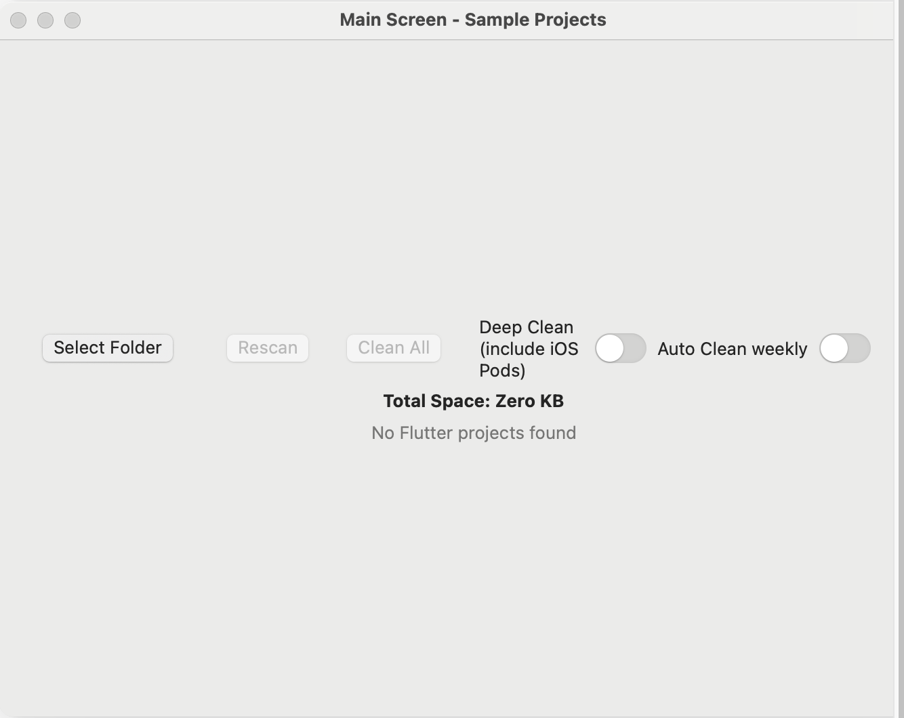
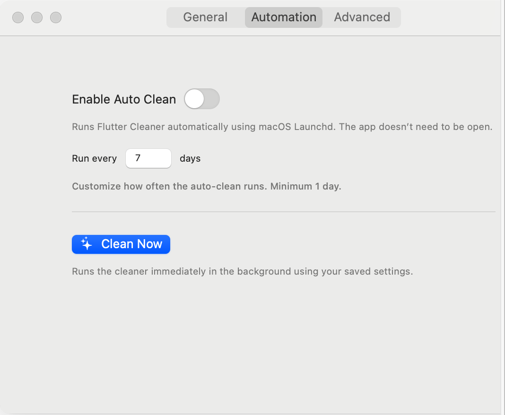
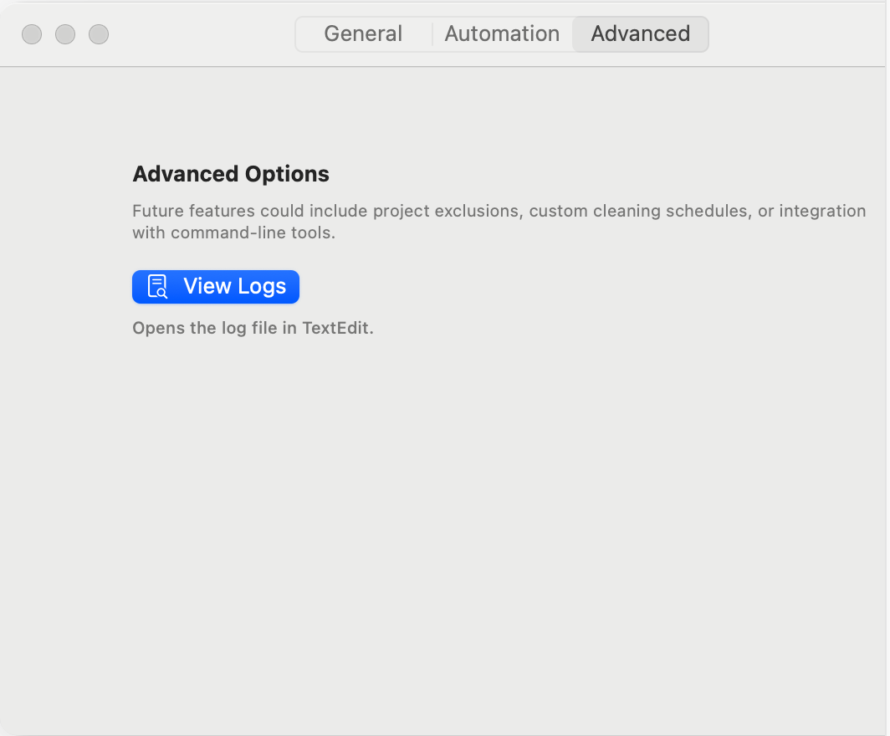

<style>
/* Center content & improve readability */
body {
    font-family: -apple-system, BlinkMacSystemFont, "Segoe UI", Roboto, Helvetica, Arial, sans-serif;
    line-height: 1.6;
    margin: 0 auto;
    padding: 2rem;
    max-width: 850px;
}

/* Center header */
h1, h2, h3 {
    text-align: center;
}

/* Big centered download button */
.download-btn {
    display: inline-block;
    background: #007AFF;
    color: white !important;
    padding: 0.9rem 1.6rem;
    border-radius: 10px;
    font-size: 1.2rem;
    text-decoration: none !important;
    margin: 1rem auto;
    text-align: center;
}
.download-btn:hover {
    background: #005FCC;
}

/* Screenshot styling */
.screenshot {
    display: block;
    margin: 1.5rem auto;
    border-radius: 12px;
    box-shadow: 0 4px 16px rgba(0,0,0,0.12);
    max-width: 100%;
}

/* Divider */
.divider {
    margin: 3rem auto;
    height: 1px;
    background: #E5E7EB;
    width: 100%;
}
</style>

# 🧹 Flutter Cleaner for macOS


A beautiful, lightweight macOS utility that finds Flutter projects on your system and helps you reclaim disk space safely — built entirely with SwiftUI.

<div style="text-align: center;">
    <a class="download-btn" href="https://github.com/vipinkashyap/FlutterCleaner/releases/latest">
        📥 Download Latest Version (.dmg)
    </a>
</div>

<div class="divider"></div>

## ✨ Features

- 🔍 Auto-detects Flutter projects on your Mac  
- 🧼 One-click `flutter clean` for individual or all projects  
- 🧠 Deep Clean mode removes Pods & Xcode build artifacts  
- ⚡ Fast search across project names & paths  
- 🕒 Auto-clean scheduler via launchd  
- 📊 Detailed logs & live cleaning summary  
- 🎨 Native SwiftUI interface with smooth animations  

<div class="divider"></div>

## 🖼 Screenshots





<div class="divider"></div>

## 🔐 Permissions

Flutter Cleaner needs **Full Disk Access** to scan your home directory:

**System Settings → Privacy & Security → Full Disk Access → Add “Flutter Cleaner”**

<div class="divider"></div>

## 💻 Requirements

- macOS 13.0 (Ventura) or newer  
- Flutter installed (`flutter` available in PATH)  

<div class="divider"></div>

## ⚠️ macOS “App is Damaged” Warning (Quarantine)

Because FlutterCleaner is distributed unsigned (developer tool, not notarized), macOS may show:

> **“FlutterCleaner.app is damaged and can’t be opened.”**

This is not an error — macOS attaches a *quarantine flag* to apps downloaded from the internet.

### ✔️ The app helps you fix it automatically  
When you open FlutterCleaner, it detects the quarantine status and shows a helper popup with:
- A one‑click **Run in Terminal…** button  
- A **Copy Command** button  
- A clickable code block that copies on tap

### ✔️ Manual one‑time fix (if needed)

```bash
sudo xattr -rd com.apple.quarantine /Applications/FlutterCleaner.app
```

After running this once, macOS will trust the app permanently.

<div class="divider"></div>

## 🛠 Open Source

Source, issues & development:  
👉 https://github.com/vipinkashyap/FlutterCleaner